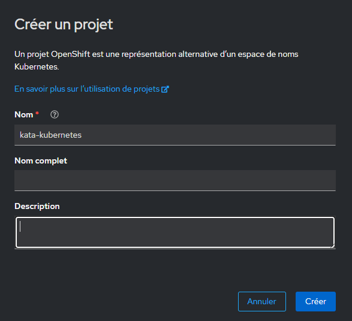
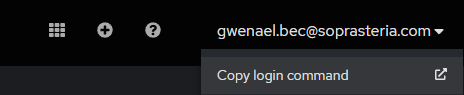

# Démystifions une architecture conteneurisée avec Kubernetes

Ce workshop s'adresse à toute personne souhaitant comprendre les bases du déploiement d'applications sur Kubernetes.  

## Pré-requis ✅
- Une connexion internet
- Un navigateur web
- Une connaissance de base des conteneurs
- VSCode

## Environnement 👩‍💻

Ouvrez le fichier `README.md` dans l'éditeur VS Code de Gitpod puis affichez la Preview du Markdown pour suivre les instructions. (Clic dans le contenu du fichier `README.md` puis `Ctrl + Shift + V`)  

La navigation entre les sections se fait via les flèches de navigation ⬅️ et ➡️.  

## Configuration 🔧

### VSCode
 - Installer l'extension `Kubernetes` via le marketplace (ou [Lien web](https://marketplace.visualstudio.com/items?itemName=ms-kubernetes-tools.vscode-kubernetes-tools))

### Installation des CLI
 - Récuperer le CLI Helm et installer sur votre poste: https://github.com/helm/helm/releases
 - Récuperer le CLI CLI Openshift sur votre poste:: https://mirror.openshift.com/pub/openshift-v4/clients/ocp/4.16.9/openshift-client-windows.zip 
 - Ajouter les dossiers des CLI dans le PATH de votre PC

### Openshift 

- Instancier un nouveau projet openshift `<trigramme>-kata-kubernetes`sur la plateforme: https://console-openshift-console.apps.ocp4.innershift.sodigital.io/
 

- Récupérer les informations de connexions d'openshift et executer le login dans votre terminal

🥳 Vous êtes READY pour commencer le kata !

## Prêt à commencer ? C'est parti [➡️](00-intro/README.md)
